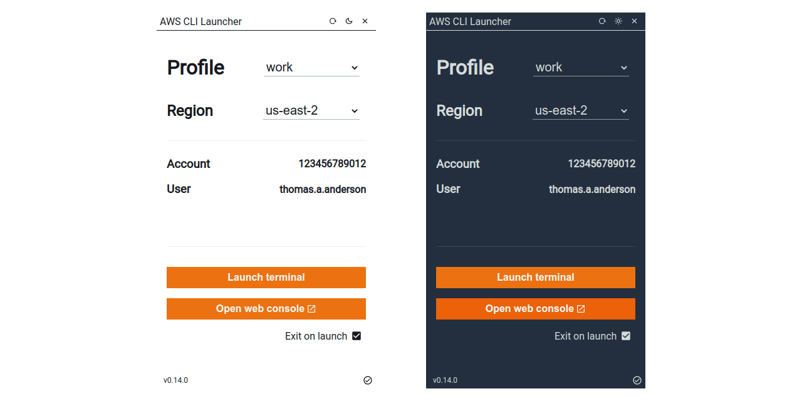

# AWS CLI Launcher

A simple application that list AWS CLI's configured profiles, assuming it, list information and launch a terminal with `AWS_PROFILE` and `AWS_REGION` environment variables set.



## Project setup
```
npm install
```

### Compiles and hot-reloads for development
```
electron:serve
```

### Build application
```
electron:build
```

### Lints and fixes files
```
npm run lint
```

## Publish new application version

Change the `version` property in package.json file:
```json
{
  "version": "1.0.0"
}
```

Create a version tag with prefix `v`:
```bash
git tag v1.0.0
```

Push tag to GitHub repository:
```bash
git push --tag
```

### Customize Vue configuration
See [Configuration Reference](https://cli.vuejs.org/config/).

### Customize Electron Builder configuration
See [Configuration Reference](https://www.electron.build/configuration/configuration).
